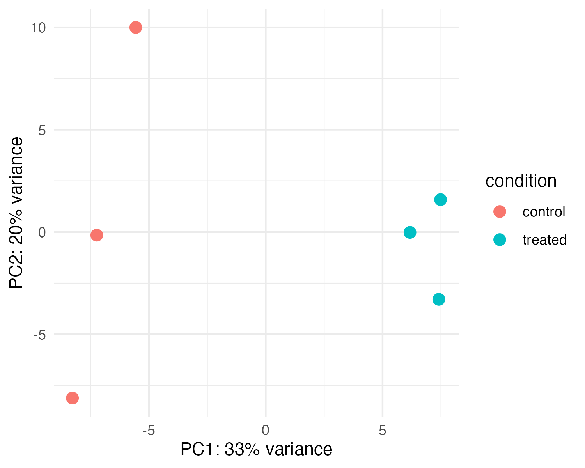
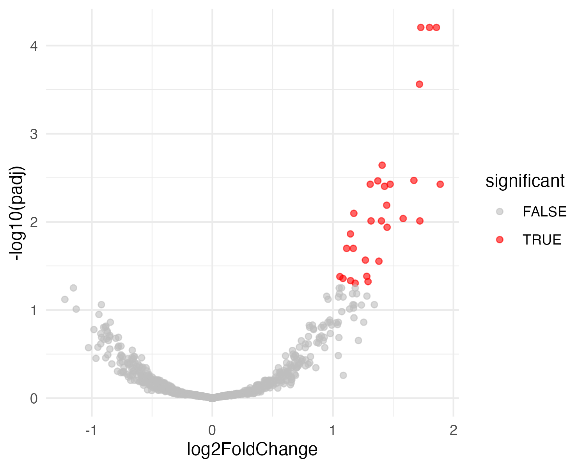

# Samantha Lane - Bioinformatics Portfolio
**M.S. Bioinformatics, Johns Hopkins University**  
**Email:** slane21@jh.edu    
**LinkedIn:** https://www.linkedin.com/in/samantha-lane-917771155/  

Bioinformatics graduate student with a focus on epigenetics and functional genomics, and a strong interest in women’s health and reproductive technology. Experienced in Python- and R-based data analysis, transcriptomics, promoter and regulatory element analysis, and interpretation of public functional genomics datasets (GTEx, GEO, ENCODE). Passionate about building clear, reproducible analyses that integrate computational rigor with biological insight.

This portfolio highlights selected projects demonstrating reproducible workflow design, statistical analysis, and cross-language integration using Python, R/Bioconductor, and modern bioinformatics tools.

## Skills
**Programming & Analysis**  
Python (Pandas, NumPy, Matplotlib); R (Bioconductor, DESeq2, tidyverse); Jupyter Notebook  

**Bioinformatics & Genomics**  
RNA-seq analysis (count-based modeling, normalization, exploratory QC); Differential expression analysis; Transcriptomics and functional genomics; Familiarity with ChIP-seq and proteomics data analysis; Public datasets (GEO, GTEx, ENCODE); Next-generation sequencing (NGS) data analysis; Multi-omics analysis using public bioinformatics tools (NCBI, Ensembl, UCSC Genome Browser; BLAST/FASTA; InterPro, TMHMM, SignalP)
  
**Reproducibility & Engineering**  
Docker; Bash scripting; Git/GitHub; Linux/macOS environments; Reproducible workflows and dependency management
  
## Featured Projects

### [Differential Expression Mini-Analysis (Simulated RNA-seq)](https://github.com/splane00/rna-seq-mini)
This pipeline simulates RNA-seq count data in Python using a negative binomial model, then applies DESeq2 in R for normalization, differential expression analysis, and exploratory visualization (PCA and volcano plots). The project emphasizes reproducibility, statistical modeling, and clean Python–R integration without external data dependencies.  

**Example outputs:**  
PCA and Volcano plots generated from simulated RNA-seq data.

  
  

  
**Key features:**
- Python-based simulation of RNA-seq count data with known differential expression
- R/DESeq2 normalization, variance stabilization, and differential expression testing
- PCA and volcano plot visualizations for exploratory analysis
- One-command execution with automatic dependency setup (macOS/Linux compatible)

**Skills:** Python, R/Bioconductor, DESeq2, Pandas, NumPy, data simulation, statistical modeling, PCA, data visualization, reproducible workflows  
**Repo:** rna-seq-mini

### [BTN1A1 Multi-Omics Characterization](https://github.com/splane00/btn1a1-analysis/blob/main/BTN1A1.pdf)  
A comprehensive bioinformatics analysis of BTN1A1 integrating genomics, transcriptomics, protein structure prediction, evolutionary conservation, and regulatory landscape annotation. This project synthesizes public datasets and computational tools to generate a research-grade multi-omics gene profile.

**Highlights:**
- Annotated BTN1A1 gene structure, isoforms, SNPs, paralogs, and orthologs
- Predicted promoter architecture, transcription factor motifs, and regulatory elements
- Modeled protein domains, Ig-like structures, signal peptide, and transmembrane topology
- Evaluated expression across tissues (GTEx) and in breast cancer (GEO GSE15852)
- Integrated ENCODE histone marks and DNase-seq to assess regulatory activity
- Performed multi-species conservation analysis using BLAST, FASTA, and MSAs

**Skills:** Genomic annotation, promoter analysis, protein structure prediction (InterPro, TMHMM, SignalP, PSIPRED), BLAST/FASTA, GTEx/GEO/ENCODE interpretation, UCSC Genome Browser, scientific writing    
**Repo:** btn1a1-analysis/BTN1A1.pdf    

## Other Projects

### Data Structures Projects
Computer science projects demonstrating algorithmic thinking and clean coding practices.  
- [Huffman encoding](https://github.com/splane00/data-struc-3)
- [Sorting algorithms (quicksort, natural merge sort)](https://github.com/splane00/data-struc-4/blob/main/README.md)  

**Skills:** Python, Git, algorithm design and implementation  

### Undergraduate Projects
**Organic Chemistry II - Special Topics Research Lab**
- Proposal: ["Optimization of Ammonia and Amine Alkylation Reactions to Selectively Form Ammonium Salts"](https://github.com/splane00/undergrad/blob/main/Optimization%20of%20Alkylation%20OCII.pdf)
- Report: ["Optimization of Williamson Ether Synthesis to Form Specific Assymmetric Ether"](https://github.com/splane00/undergrad/blob/main/Williamson%20Ether%20Synthesis%20OCII.pdf)  

**Skills:** Scientific research, scientific writing, lab experimentation, ¹H NMR, data analysis  
**Repo:** undergrad

**Biomedical Humanities Projects**
- Capstone Literature Review: ["Ethical Implications of Clinical Responses to Patients Presenting with Suicial Ideation"](https://github.com/splane00/undergrad/blob/main/BHUM%20Lit%20Review.pdf)
- Feasibility Report: ["Feasibility of Using Pharmacogenomics as Standard Practice in Psychiatric Healthcare"](https://github.com/splane00/undergrad/blob/main/Feasibility_of_Using_Pharmacogenomics_in_Psychiatric_Healthcare_APA.pdf)  

**Skills:** Literature review, academic writing  
**Repo:** undergrad
